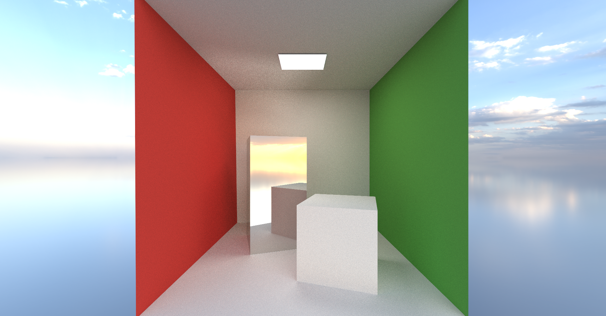

Examples of renders:

Parameters:
- 1024 samples,
- 8 bounces,
- 36 triangles including 2 emissive triangles.

Parameters:
- 1024 samples,
- 8 bounces,
- 980 triangles including 2 emissive triangles.

Parameters:
- 1024 samples,
- 8 bounces,
- 980 triangles including 2 emissive triangles.

Parameters:
- 1500 samples,
- 8 bounces,
- 980 triangles including 2 emissive triangles.

Parameters:
- 1500 samples,
- 8 bounces,
- 69463 triangles including 2 emissive triangles.